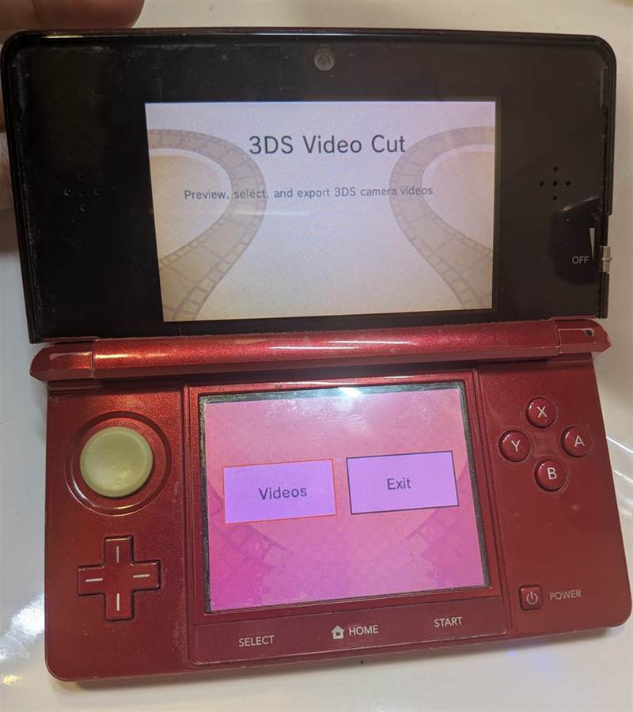
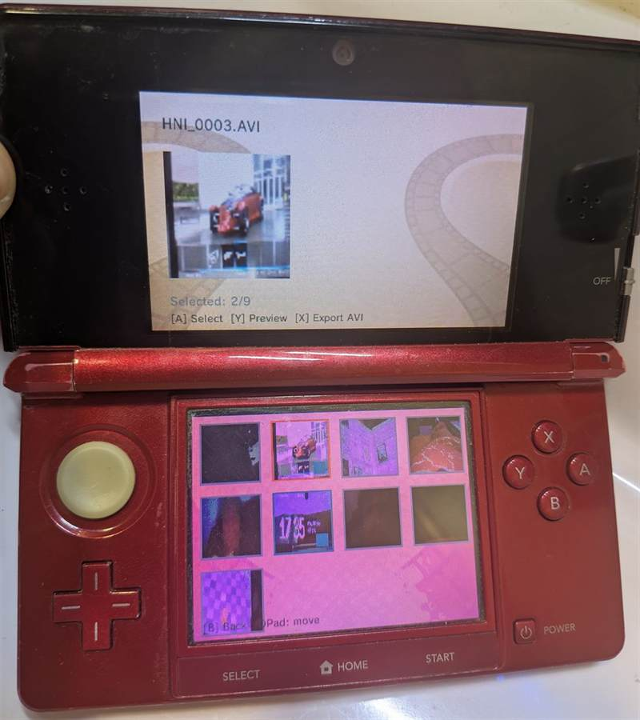
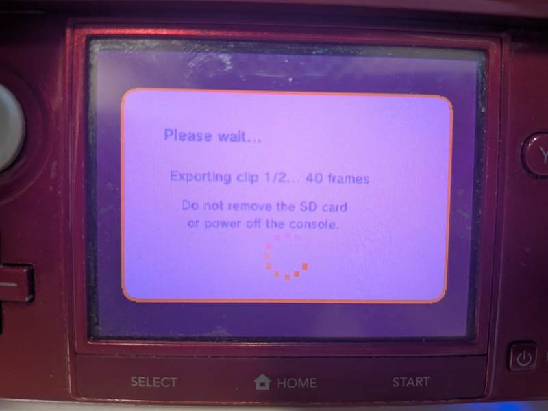

# 3DS Video Cut

3DS Video Cut is a Nintendo 3DS homebrew video editor built with devkitPro, libctru, citro2d, and citro3d.

The app currently scans the SD card for Nintendo 3DS camera `.AVI` files, builds thumbnail previews, lets the user select clips, plays a simple MJPEG-style preview by decoding embedded JPEG frames, and exports selected clips into one MJPEG `.AVI` file.

This is not a complete video editor yet.

## Photos

<table>
  <tr>
    <td width="50%" align="center">
      <strong>Menu</strong><br>
      
    </td>
    <td width="50%" align="center">
      <strong>Gallery</strong><br>
      
    </td>
  </tr>
  <tr>
    <td colspan="2" align="center">
      <strong>Export</strong><br>
      
    </td>
  </tr>
</table>

## Current Features

- Main menu and touch/D-Pad navigation.
- Gallery view for `.AVI` files found in `sdmc:/DCIM/100NIN03/`.
- Thumbnail cache stored at `sdmc:/3DSVideoCut/temp/thumbnails/`.
- Startup thumbnail preparation with a loading spinner.
- JPEG thumbnail extraction from AVI/MJPEG-style camera videos.
- Top-screen preview for selected clips.
- Clip selection using buttons or touch.
- AVI export to `sdmc:/3DSVideoCut/export.avi`.
- ROMFS background assets for the top and bottom screens.
- Loading dialog with a small generated NDSP spinner.

## Requirements

- devkitPro with the 3DS toolchain installed.
- `DEVKITARM` and the standard devkitPro environment variables configured.
- libctru, citro2d, citro3d, and the standard 3DS build tools from devkitPro.
- A Nintendo 3DS homebrew setup, or another environment capable of running `.3dsx` homebrew.

On Windows, the easiest way to build is usually from a devkitPro/MSYS2 shell so `make`, `DEVKITARM`, and the 3DS tools are all on the path.

## Build

Open a devkitPro/MSYS2 terminal in the project folder and run:

```sh
make
```

That creates the 3DS homebrew file and related build output:

- `3ds_video_cut.3dsx`
- `3ds_video_cut.smdh`
- `3ds_video_cut.elf`

To remove build output:

```sh
make clean
```

## Running On A 3DS

1. Build the project.
2. Copy `3ds_video_cut.3dsx` and `3ds_video_cut.smdh` to a folder on the SD card, for example:

```text
sdmc:/3ds/3ds_video_cut/
```

3. Make sure test videos exist in:

```text
sdmc:/DCIM/100NIN03/
```

4. Launch the app through the Homebrew Launcher.

The source currently uses a hardcoded camera folder:

```c
#define DCIM_PATH "sdmc:/DCIM/100NIN03/"
```

Change this in `source/main.c` if your camera videos are stored somewhere else.

## Controls

### Global

- `START`: quit the app.

### Main Menu

- `Left` / `Right`: switch between menu buttons.
- `A`: open the selected menu item.
- Touch: tap a menu button.

### Gallery

- `D-Pad`: move through videos.
- `A`: select or unselect the highlighted video.
- `Y`: preview the highlighted video.
- `X`: export selected videos to `sdmc:/3DSVideoCut/export.avi`. If nothing is selected, the highlighted video is exported.
- `B`: return to the menu.
- Touch: tap a thumbnail to select or unselect it.

### Preview

- `A`: play or pause.
- `Right`: step to the next decoded JPEG frame.
- `B`: return to the gallery.

## How It Is Made

The project started from the standard devkitPro 3DS application template and was expanded into a single-file app.

Important files:

- `source/main.c`: app state, rendering, input handling, thumbnail loading, MJPEG preview, and AVI export.
- `include/stb_image.h`: vendored JPEG decoder used through `stbi_load_from_memory`.
- `include/video_viewer.h`: older/planned viewer API header. The current app logic is implemented directly in `source/main.c`.
- `romfs/gfx/*.t3x`: background textures loaded with `C2D_SpriteSheetLoad`.
- `Makefile`: devkitPro 3DS build configuration and app metadata.

The app is organized around a small state machine:

- `STATE_MENU`: title/menu screen.
- `STATE_GALLERY`: scans and displays camera videos.
- `STATE_PLAYER`: decodes and previews JPEG frames from a selected AVI.
- `STATE_EXPORT`: reserved for future export work.
- `STATE_LOADING`: reserved/loading dialog support.

Rendering uses citro2d/citro3d with separate render targets for the top and bottom screens. Backgrounds are loaded from ROMFS. Video thumbnails are prepared during startup, decoded from JPEG data, resized in software, tiled into the 3DS GPU texture layout, and uploaded as `C2D_Image` textures.

The video handling is intentionally simple right now. It prefers the primary AVI video stream (`00dc`) so 3DS stereo recordings do not export both views into one output. It falls back to JPEG marker scanning for simple MJPEG-like files. Export writes the selected primary-view frames into a basic MJPEG AVI container.

## Current Limitations

- Only AVI/MJPEG-style files with embedded JPEG frames are expected to preview correctly.
- The camera folder is hardcoded to `sdmc:/DCIM/100NIN03/`.
- Individual JPEG frames larger than the frame buffer limit are skipped.
- Export currently writes video frames only; it does not preserve audio.
- 3D/stereo videos are exported as the primary view only.
- There is no timeline or trimming UI yet.

## Contributing

Contributions are welcome, especially focused changes that move the app closer to a complete 3DS video tool.

Before opening a pull request:

1. Build with `make clean && make`.
2. Test the `.3dsx` on real hardware or in a compatible homebrew test environment.
3. Include a short summary of what changed.
4. Mention how you tested it, including hardware/emulator details and the kind of video file used.
5. Add screenshots or a short capture when changing UI behavior.

Good contribution areas:

- Add a `.gitignore` for build output and local IDE files.
- Make the video folder configurable.
- Improve AVI/MJPEG parsing.
- Add safer memory checks and cleanup paths.
- Split `source/main.c` into smaller modules.
- Implement real trim/export behavior.
- Add audio preservation or audio export support.

Please avoid committing:

- `build/`
- generated `.3dsx`, `.elf`, `.smdh`, or `.map` files
- local IDE folders such as `.vs/`
- SD card cache/output files

## Coding Style

- Prefer small, readable C functions with explicit ownership of allocated memory.
- Keep 3DS-specific resource cleanup near the code that allocates the resource.
- Use `linearAlloc`/`linearFree` for GPU/DSP resources that need linear memory.
- Keep UI changes usable on both the top and bottom 3DS screens.
- When adding media features, document the accepted file format and memory assumptions.

## License

This project is released under the MIT License. See [LICENSE](LICENSE) for details.
